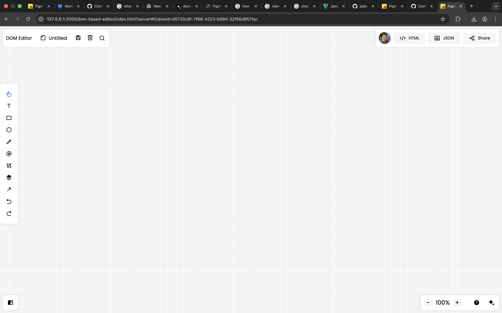

# mini figma-style web editor (vanilla js)

this project is a **browser-based design editor** inspired by figma-like workflows.  
it is built **from scratch using only html, css, and vanilla javascript (dom)** as required in the **inter batch showdown** by sheryians coding school.

the goal of this project is to demonstrate **core frontend fundamentals, dom manipulation, state handling, and user interaction logic** without using any framework or external library.

---

## 📌 competition alignment (based on official pdf)

**project type:** frontend web project  
**tech stack:** html, css, javascript (dom only)  
**frameworks/libraries:** ❌ none used  
**ai usage:** ✅ only for guidance & debugging (no copy-paste code)

this project follows all mandatory rules mentioned in the competition document:
- all logic written manually
- no frameworks or external libraries
- full understanding of each feature implemented
- originality in ui/ux and internal logic
- no code sharing before result declaration  
 [oai_citation:0‡Inter Batch Showdown.pdf](sediment://file_00000000cd4c71faa2e91dbd468d44bb)

---

## ✨ core features implemented (mandatory + extended)

### 1. shape creation tools
- rectangle tool
- circle tool (rectangle logic + border-radius)

**how to use**
1. select rectangle or circle tool from the left toolbar
2. click and drag inside the workspace to draw the shape

---

### 2. text tool (extended feature)
- create editable text boxes
- auto-focus after creation
- text is saved in real time

**how to use**
1. select text tool
2. click anywhere on the canvas
3. start typing immediately
4. click outside to finish editing

---

### 3. select & move elements
- click to select any element
- drag to move it freely on canvas
- selected element is visually highlighted

**how to use**
1. select the cursor/select tool
2. click on an element
3. drag it to reposition

---

### 4. delete element (keyboard + ui logic)
- delete selected element using:
  - `delete` key
  - `backspace` key
- delete is disabled while editing text (to prevent data loss)

**how to use**
1. select any element
2. press `delete` or `backspace`

---

### 5. rotation tool
- rotate selected element by **15° per click**
- rotation state is stored and restored

**how to use**
1. select an element
2. click the rotate icon in the toolbar

---

### 6. keyboard movement (extended)
- move selected element using arrow keys
- smooth 5px step movement

**keys**
- ↑ move up
- ↓ move down
- ← move left
- → move right

---

### 7. export features
#### export as json
- exports editor data (positions, size, rotation, text)
- useful for restoring state or backend integration

#### export as html
- generates static html layout
- exported file opens independently in browser

**how to use**
- click `export json` or `export html` from top-right buttons

---

### 8. local storage persistence (extended)
- editor auto-saves to `localStorage`
- design is restored on page reload
- manual save button also provided

**how to use**
- work is saved automatically
- click save icon to force save

---

### 9. cursor & tool feedback (extended ux)
- cursor changes based on active tool
- active tool icon highlights automatically
- prevents user confusion during interactions

---

### 10. share feature
- copies current project url to clipboard

**how to use**
- click the `share` button

---

## 🧪 how to test the project

1. open `index.html` in any modern browser
2. create shapes and text
3. move, rotate, delete elements
4. reload page → verify auto restore
5. export json/html and open exported files
6. test keyboard controls (arrow keys + delete)

---

## 🖼️ project preview image

