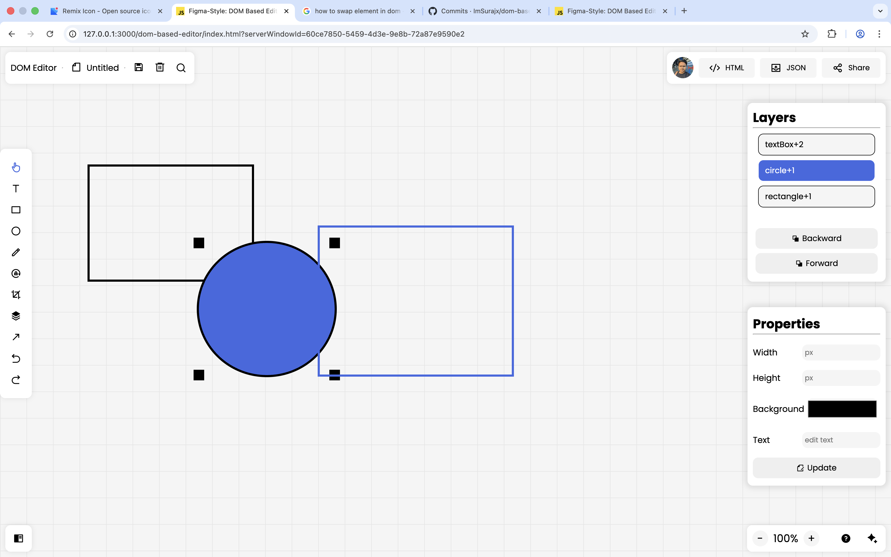

# 🎨 Dom Based Editor

**Dom Based Editor** is a browser-based design editor inspired by figma-like workflows ✨  
It is built **from scratch using only HTML, CSS, and Vanilla JavaScript (DOM)** as required in the **Inter Batch Showdown** by **Sheryians Coding School** 🏫.

The goal of this project is to demonstrate **strong frontend fundamentals** 💪, including:
- 🧠 DOM manipulation  
- 🔁 state management  
- 🖱️ keyboard & mouse interactions  
- ⚡ event-driven UI logic  

🚫 No frameworks. 🚫 No libraries.  
Everything is handcrafted.

---

## 🏁 Competition Alignment

- **Project Type:** Frontend Web Project  
- **Tech Stack:** HTML, CSS, JavaScript (DOM only)  
- **Frameworks / Libraries:** ❌ None  
- **AI Usage:** ✅ Only for guidance, debugging, and logic clarification  

This project strictly follows all competition rules:
- ❌ No frameworks or libraries  
- ✍️ All logic written manually  
- 🧩 Clear understanding of each feature  
- 🚫 No copied or auto-generated code  
- 🎨 Original UI/UX decisions  
- 🔒 Repository frozen after submission  

---

## 🚀 Features Implemented

### 🟦 Shape Creation Tools
- Rectangle tool  
- Circle tool (rectangle logic with `border-radius`)

**How to use**
1. Select rectangle or circle tool from the left toolbar  
2. Click and drag inside the workspace  

---

### ✏️ Text Tool
- Editable text boxes  
- Auto-focus after creation  
- Real-time text persistence  

**How to use**
1. Select the text tool  
2. Click anywhere on the canvas  
3. Start typing immediately  
4. Click outside to finish editing  

---

### 🖱️ Select & Move Elements
- Click to select an element  
- Drag to move freely  
- Selected element is visually highlighted  

---

### 🔲 Resize Elements
- Resize using **four corner handles**  
- Width and height update dynamically  
- Real-time resize with mouse movement  

---

### 🗑️ Delete Element
- Delete selected element using:
  - `Delete` key  
  - `Backspace` key  
- Disabled while editing text to prevent accidental deletion  

---

### 🔄 Rotation Tool
- Rotate selected element by **15° per click**  
- Rotation state is preserved and restored  

---

### ⌨️ Keyboard Movement
- Move selected element using arrow keys  
- Smooth movement in **5px steps**

---

### 🧱 Layers Panel
- Displays all elements on the canvas  
- Each layer represents one element  
- Clicking a layer selects the element on canvas  
- Supports:
  - ⬇️ Send backward  
  - ⬆️ Bring forward  
- Layer order is synced with canvas stacking  

---

### 🧩 Properties Panel (UI Ready)
- Dedicated properties panel UI  
- Controls available for:
  - 📐 Width  
  - 📏 Height  
  - 🎨 Background color  
  - 📝 Text content (text elements only)

> ℹ️ UI is fully implemented.  
> Live binding logic can be extended further if required.

---

### 📤 Export Features

#### 📄 Export as JSON
- Exports complete editor data  
- Includes position, size, rotation, and text content  

#### 🌐 Export as HTML
- Generates a standalone static HTML file  
- Can be opened directly in a browser  

---

### 💾 Local Storage Persistence
- Auto-saves editor state to `localStorage`  
- Restores design automatically on reload  
- Manual save button also provided  

---

### 🎯 Cursor & Tool Feedback
- Cursor updates based on active tool  
- Active tool icon highlights automatically  

---

### 🔗 Share Feature
- Copies current project URL to clipboard  

---

## 🧪 How to Test the Project

1. Open `index.html` in any modern browser 🌍  
2. Create rectangles, circles, and text boxes  
3. Select, move, resize, and rotate elements  
4. Test keyboard movement and delete keys  
5. Reload page to verify persistence  
6. Test layers panel ordering and selection  
7. Export JSON and HTML files  

---

## 🤖 AI Usage Disclosure

AI (ChatGPT) was used **only for guidance, debugging help, and conceptual clarification**.  
All code, logic, structure, and final decisions were implemented manually ✍️.

---

## 🔒 Submission Notice

This repository is **frozen for submission** 🧊.  
No further commits will be made until competition results are announced.

📜 For detailed progress, please refer to the Git commit history.